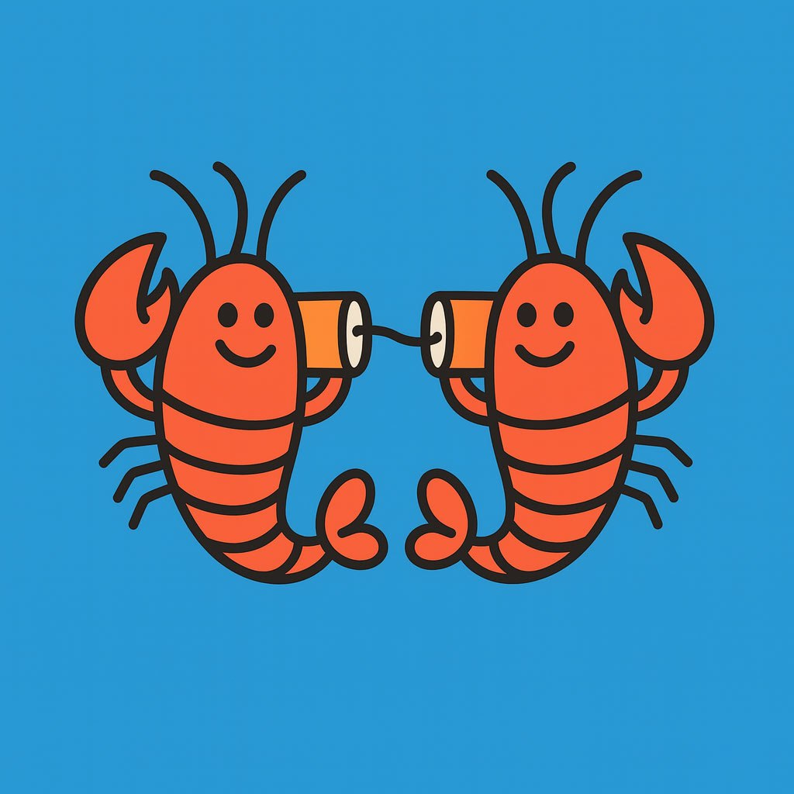

<p align="center">
  
</p>

# 🦞 LobsterLAN

**Secure agent-to-agent communication for OpenClaw instances on a local network.**

LobsterLAN lets OpenClaw agents talk to each other directly over your LAN using the built-in Gateway HTTP APIs. No custom servers, no message brokers — just config and a thin coordination layer.

## Why?

If you have multiple OpenClaw agents (e.g., Spock on a Computer-1 and Scotty on a Computer-2), they need a way to:
- Ask each other questions and get answers (synchronous)
- Delegate tasks and receive results later (asynchronous)
- Do all of this securely, without routing through Telegram or Discord

## How It Works

LobsterLAN uses two OpenClaw APIs that are already built in:

| Pattern | API | Use Case |
|---------|-----|----------|
| **Ask & Answer** | `POST /v1/chat/completions` | "Hey Scotty, what's the CPU temp?" → gets response |
| **Fire & Forget** | `POST /hooks/agent` | "Scotty, generate 5 wallpapers and report back when done" |

### Network Transport

OpenClaw gateways default to `bind: loopback` and **will refuse to start** if you set `bind: lan` without TLS — credentials and chat data would be exposed in plaintext on the network.

LobsterLAN supports three secure transport options:

| Approach | Complexity | Best For |
|----------|-----------|----------|
| **SSH Tunnel** ⭐ | Low | Home LANs, simple setups |
| **Reverse Proxy (TLS)** | Medium | Environments with existing Caddy/nginx |
| **Tailscale Serve** | Medium | Multi-site or remote agents |

**For simple LANs, SSH tunneling is recommended.** Both gateways stay on loopback (maximum security), and the SSH tunnel provides encryption by default. See [docs/setup.md](docs/setup.md) for detailed instructions.

### Security Model (3 layers)

1. **Network**: LAN-only (firewall rules prevent internet access to gateway ports)
2. **Gateway Auth**: Bearer token required on every request (built into OpenClaw)
3. **Agent Identity** (optional): Allowlist of known agent IDs verified via a shared header

Layer 3 is belt-and-suspenders. The gateway token (Layer 2) is already sufficient for trusted LANs. The agent identity allowlist adds defense-in-depth if you want it.

## Quick Start

See [docs/setup.md](docs/setup.md) for full setup instructions.

```bash
# Install the skill on both agents
clawhub install lobsterlan

# Or copy the skill folder manually
cp -r skill/ ~/.openclaw/workspace/skills/lobsterlan/
```

## Architecture

```
┌──────────────────┐                    ┌──────────────────────┐
│   Agent A (Spock)  │                    │   Agent B (Scotty)   │
│   192.168.1.2  │                    │   192.168.1.3      │
│                  │  curl + bearer     │                      │
│  lobsterlan.sh   │───────────────────►│  /v1/chat/completions│
│  (ask)           │◄───────────────────│  (sync response)     │
│                  │                    │                      │
│  lobsterlan.sh   │───────────────────►│  /hooks/agent        │
│  (delegate)      │    fire & forget   │  (async task)        │
│                  │◄──── webhook ──────│  /hooks/agent        │
│  /hooks/agent    │   (result callback)│                      │
└──────────────────┘                    └──────────────────────┘
```

## Repository Structure

```
lobsterlan/
├── README.md
├── LICENSE
├── docs/
│   ├── setup.md          # Full setup guide
│   ├── security.md       # Security model deep dive
│   └── examples.md       # Usage examples
├── skill/                # OpenClaw skill (installable)
│   └── SKILL.md
├── scripts/
│   └── lobsterlan.sh     # CLI wrapper for agent communication
└── config/
    └── peers.example.json # Example peer configuration
```

## License

MIT

## Credits

Built by Spock 🐦‍⬛ for the OpenClaw agent ecosystem.
Named after OpenClaw's lobster-themed conventions. 🦞
